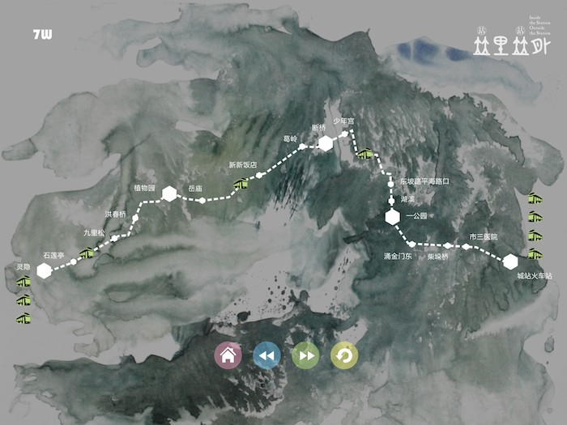

4 . The location information. The visual positioning of the actual operation situation of bus.

Through this page, the user can intuitively understand the actual operation of public transportation. You can know how many buses in the terminus is ready to be issued at this moment.And where is the bus issued already .

