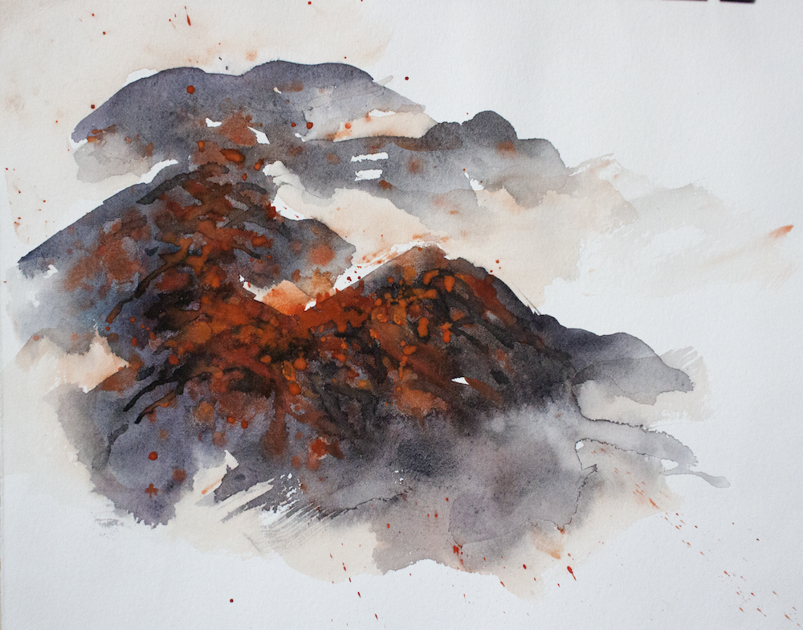
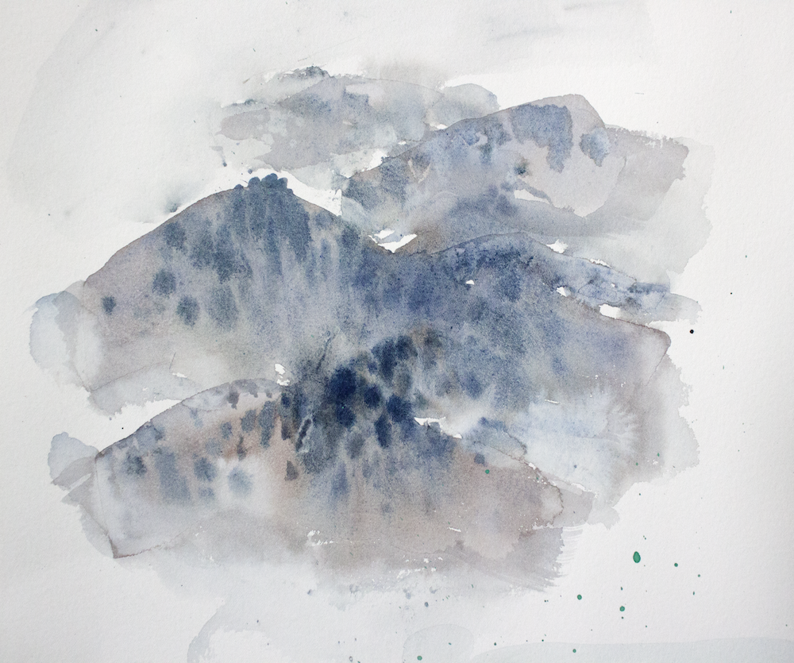
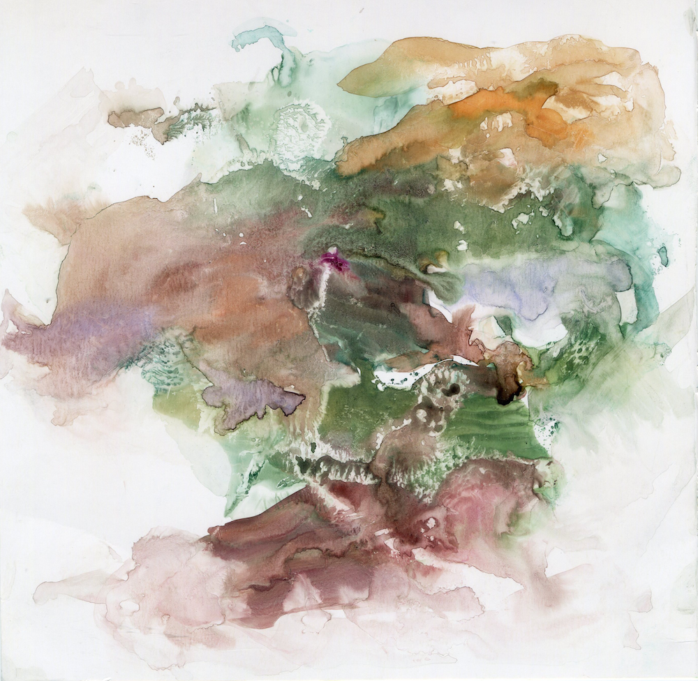
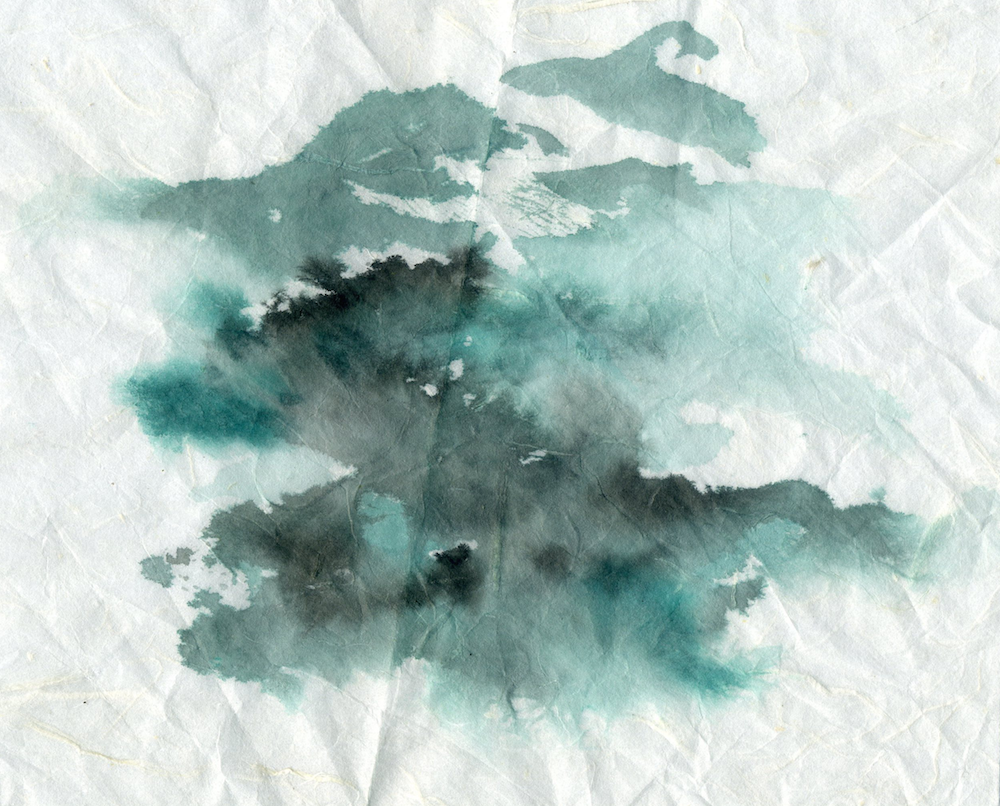

# Inside the Station Outside the Station

## Authors
- Jing Shan
- Yannan Xu 
- Tingting Shao

## Concept 
We tried to do a project, it is the most beautiful bus lines with 200 city all around the world.And use the open-source approach to achieve the data. Thus proposed a new concept of bus travel, forming some pictures of the distinctive cities tour cards. 
  

## Embodiment
We picked out the most beautiful bus line in Hangzhou as our best practice.  That is how we do in Hangzhou. Then we open it up, these cities all around the world you can do such a thing like us. Thus we get the world's 200 most beautiful bus lines.

## Ink manuscripts

## Concept Demonstration
We have chosen ink to express the form of Hangzhou taste.Results of our practice presented in a way to interact with web pages, interactive content, including 

1 text message, text information about the surrounding attractions 
The image information, including 
    
    a each site a logo, 
    
    b multidimensional Street 
    
    c When King dynamic, users upload pictures to share on a node, you can comment and socializing, 

2 multi-dimensional (weather, season) 

3 video information, you can see the real bus line video, video progress bar is the route 

4 Voice message, the voice of attractions associated with the site information 

5 position information, visualization locate the bus that actual operating conditions 
Technology
## Images & Videos

