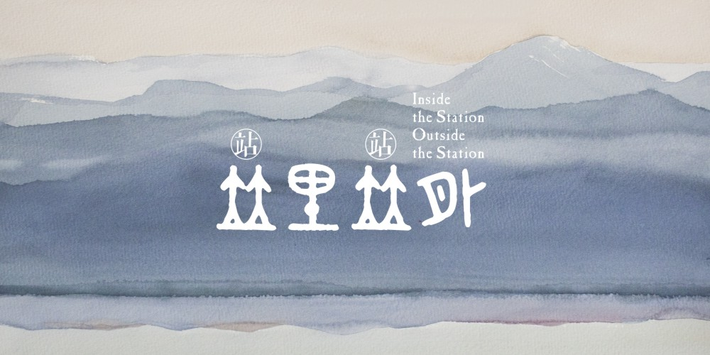

# Inside the Station Outside the Station

## Authors
- Jing Shan
- Yannan Xu 
- Tingting Shao

We want to use a new way to design a bus search the web . Doing a global 200 most beautiful city bus lines with the open-source approach. Thus propose a new concept of bus travel and forming some unique cities tour cards.

We want a this search site has the unique style of the city . And you can see the video information about the scenery along the way . You can see the run-time dynamic bus information and so on .

We picked out a beautiful bus lines in Hangzhou as our best practices . We provide a complete solution .That is how we do in Hangzhou . Then we open it up . These cities all around the world can do such a thing like us. Thus we get the world's 200 most beautiful bus lines .
This design will be placed on bus stations, in the form of Web pages to facilitate tourists inquiry

